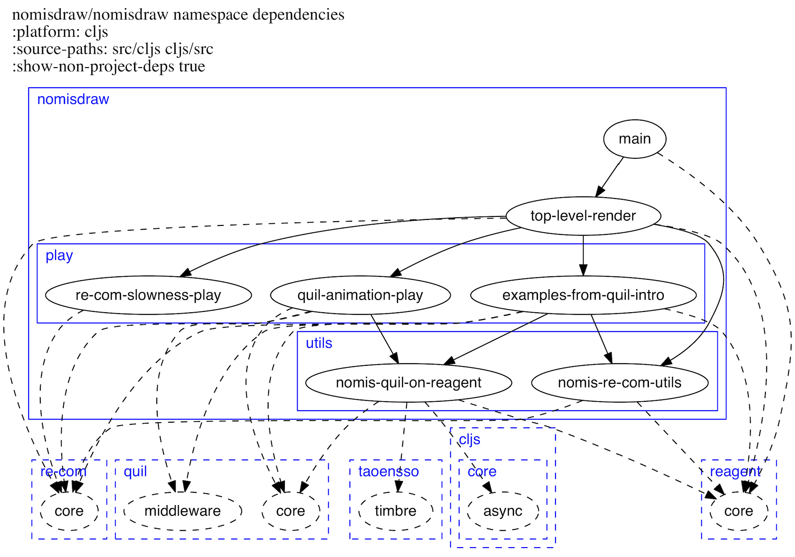

# lein-nomis-ns-graph

A Leiningen plugin that shows a Clojure project's namespace dependencies
as a graph, and also shows the namespace hierarchy.

**This documentation tracks the `master` branch. Consult
the relevant Git tag (e.g. `0.12.0`) if you need documentation for a
specific release.**

## Examples

An example namespace graph:

## Requirements

* [Graphviz](http://www.graphviz.org/) must be installed. (Run `dot -V` at the command line to check whether you have it.)

## Installation

Current version:

You probably want this plugin to be available to multiple projects, so add
the above coordinates to the
`:plugins` vector of your `:user` profile.

## Usage

Run when in a Clojure project directory.

### Basic Usage

To show dependencies between Clojure namespaces:

    lein nomis-ns-graph

This produces a file called `nomis-ns-graph.png` showing namespace dependencies
within the project's `.clj` sources.

### Specifying an Output File

To specify a different output file:

    lein nomis-ns-graph :filename foo

This will produce a file named `foo.png` instead of the default
`nomis-ns-graph.png`.

### ClojureScript

To show dependencies between ClojureScript namespaces (assuming ClojureScript
source is in either `src/cljs` or `cljs/src`):

    lein nomis-ns-graph :platform cljs

The default is `:platform clj`.

### Source Paths

To specify source paths (useful if the defaults for ClojureScript are wrong
for your project):

    lein nomis-ns-graph :source-paths "a/b c/d e/f"

The separator for the source paths can be either a space or a vertical bar (|).
(I found spaces didn't work when using Git Bash on Windows. Strange.)

The defaults are the `:source-paths` in the project definition.

### Non-Project Dependencies

To show one level of dependencies going to namespaces outside of your project:

    lein nomis-ns-graph :show-non-project-deps

### Inclusions and Exclusions Using a Prefix

In the following, as for source paths, the separator can be
either a space or a vertical bar (|).

#### Inclusions

To include namespaces using a prefix:

    lein nomis-ns-graph :inclusions "user timbre"

#### Exclusions

To exclude namespaces using a prefix:

    lein nomis-ns-graph :exclusions "user timbre"

#### Example of Matching

For a namespace named `aaa.bbb.ccc`, the following strings would all match
and no other strings would match:

* aaa.bbb.ccc
* aaa.bbb.cc
* aaa.bbb.c
* aaa.bbb.
* aaa.bbb
* aaa.bb
* aaa.b
* aaa.
* aaa
* aa
* a

### Inclusions and Exclusions Using a Regex

#### Inclusions

To include namespaces using a regex:

    lein nomis-ns-graph :inclusions-re "^my-prefix|\.my-full-section\.|my-any-section"

#### Exclusions

To exclude namespaces using a regex:

    lein nomis-ns-graph :exclusions-re "^my-prefix|\.my-full-section\.|my-any-section"

#### Example of Matching

For a namespace named `aaa.bbb.ccc`, the following regular expressions would all
match:

* \^a
* \\.bbb\\.
* b

### Writing a .gv File

To write a `.gv` file:

    lein nomis-ns-graph :write-gv-file?

lein-nomis-ns-graph uses Graphviz under the covers.

Before the `.png` file is produced, an intermediate Graphviz dot file format
version of the namespace graph is produced.

If this option is provided, lein-nomis-ns-graph writes the intermediate version
to a file. The file has the same base name as the `.png` file, but a `.gv`
extension.

The Graphviz dot file format is a text format, so this is useful when developing
and debugging.

## Acknowledgments

Inspired by the following:

* https://github.com/hilverd/lein-ns-dep-graph (which was copied to get started).
* https://github.com/alexander-yakushev/ns-graph

The plugin itself is small; all the hard work is done by
[clojure.tools.namespace](https://github.com/clojure/tools.namespace) and
[nomis-rhizome](https://github.com/simon-katz/nomis-rhizome).

## License

Portions copyright © 2013 Hilverd Reker

Copyright © 2017 Simon Katz

Distributed under the Eclipse Public License, the same as Clojure.
