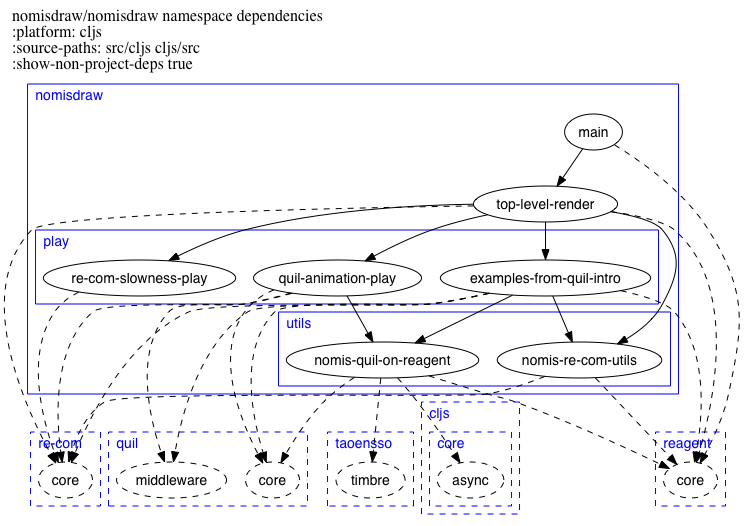

# lein-nomis-ns-graph

This is a Leiningen plugin to show the namespace hierarchies and dependencies of
Clojure project sources as a graph.

Inspired by the following:

* https://github.com/hilverd/lein-ns-dep-graph (which was copied to get started).
* https://github.com/alexander-yakushev/ns-graph

This documentation hasn't been updated to include the newly-added features in
the fork.

## Examples

An example namespace graph:

## Requirements

You will need to have [Graphviz](http://www.graphviz.org/) installed. Run `dot
-V` at the command line to check.

## Installation and Usage

Put `[lein-nomis-ns-graph "0.10.0-SNAPSHOT"]` into the `:plugins` vector of your
`:user` profile.

## Usage

Run when in a Clojure project directory.

### Basic Usage

To show dependencies between Clojure namespaces:

    lein nomis-ns-graph

This produces a file called `nomis-ns-graph.png` showing namespace dependencies
within the project's `.clj` sources.

### Specifying an Output File

To specify a different output file:
    lein nomis-ns-graph :filename foo

The default is `nomis-ns-graph`.

### ClojureScript

To show dependencies between ClojureScript namespaces (assuming ClojureScript
source is in either `src/cljs` or `cljs/src`):

    lein nomis-ns-graph :platform cljs

The default is `:platform clj`.

### Source Paths

To specify source paths (useful if the defaults for ClojureScript are wrong
for your project):

    lein nomis-ns-graph :source-paths "a/b c/d e/f"

The separator for the source paths can be a vertical bar (|). I found I
needed this when using Git Bash on Windows -- space didn't work. (Strange.)

The defaults are the `:source-paths` in the project definition.

### Non-Project Dependencies

To show one level of dependencies going to namespaces outside of your project:

    lein nomis-ns-graph :show-non-project-deps

### Exclusions

To exclude namespaces:

    lein nomis-ns-graph :exclusions "user timbre"

Namespaces are not shown if they start with any of the supplied strings.

As for source paths, the separator for the source paths can be a vertical bar
(|).

## Acknowledgements

Inspired by the following:

* https://github.com/hilverd/lein-ns-dep-graph (which was copied to get started).
* https://github.com/alexander-yakushev/ns-graph

The plugin itself is tiny, all the hard work is done by
[clojure.tools.namespace](https://github.com/clojure/tools.namespace) and
[Rhizome](https://github.com/ztellman/rhizome).

## License

Portions copyright © 2013 Hilverd Reker

Copyright © 2017 Simon Katz

Distributed under the Eclipse Public License, the same as Clojure.
